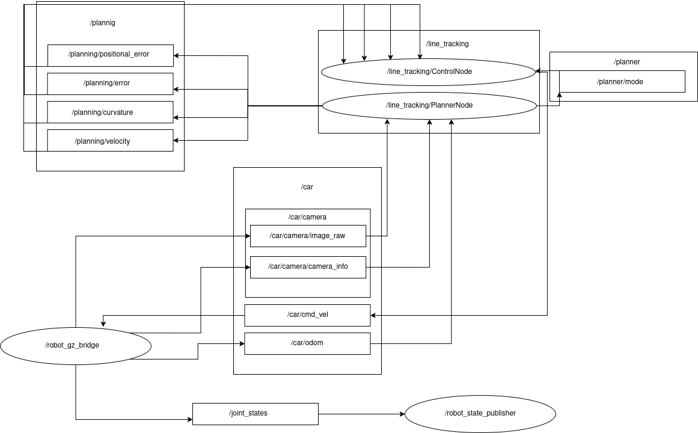

# Line Tracking Race ROS2

This repository contains a ROS2 project for a simulated line-following race car. The primary goal is to navigate a track defined by a yellow line as quickly and accurately as possible. The project is built for ROS2 and uses Gazebo for simulation.



## System Architecture

The application follows a classic planning and control architecture:

*   **Planning**: A `planner_node` subscribes to camera images, processes them to find the track, and calculates an error value representing the robot's deviation from the desired path. It can be configured to use several different planning strategies.
*   **Control**: A `better_control_node` subscribes to the error value from the planner and implements an enhanced PID controller with adaptive gains and feedforward control to generate velocity commands for the robot.

## Building and Running

1.  **Build the workspace:**
    ```bash
    colcon build
    ```

2.  **Source the workspace:**
    ```bash
    source install/setup.bash
    ```

3.  **Launch the simulation and application:**
    ```bash
    ros2 launch line_tracking_race_application full_launch.py
    ```

## Configuration and Development

### Planning Strategy

The `planner_node` can be configured to use different planning strategies by passing the `strategy` argument to the launch file.

```bash
ros2 launch line_tracking_race_application full_launch.py strategy:=<strategy_name>
```

Available strategies are:
*   `centroid`: This strategy calculates the centroid of the detected line and uses it to compute the error. This is the default strategy.
*   `centerline`: This strategy fits a line to the detected track and computes the error based on the robot's position relative to the centerline.
*   `better_centerline`: An improved version of the `centerline` strategy. It uses bilateral interpolation for more robust centerline detection and publishes both track curvature and the robot's positional error, enabling more advanced control.
*   `exploration_based`: A complex, two-phase strategy.
    1.  **Exploration Phase**: The robot drives cautiously, following the centerline to build a 2D map of the entire track using an Inverse Perspective Mapping (IPM) from the camera and odometry data.
    2.  **Exploitation Phase**: Once the robot detects it has completed a lap (loop closure), it switches to exploitation mode. In this phase, it uses the generated map to compute an optimal, high-speed velocity profile for the entire course and races aggressively.

### Advanced PID Controller

The `better_control_node` implements an advanced PID controller with several key features:

*   **Adaptive Gains**: The PID gains (Proportional, Integral, Derivative) are dynamically adjusted based on the robot's operational mode (e.g., lower gains for cautious exploration, higher gains for aggressive exploitation).
*   **Feedforward Control**: It uses the track curvature data published by the planner to anticipate turns. This allows the controller to proactively adjust steering, leading to much better stability and higher speeds in corners.
*   **Performance Logging**: The controller logs detailed data (like error, control output, and PID terms over time) to a CSV file in the `line_tracking_race_application/log` directory. It also generates plots to help with tuning and performance analysis.

### PID Controller Tuning

**Important Note:** While the project contains a `config/pid_params.yaml` file, the `better_control_node.py` currently **does not** use it. The PID gains (`k_p`, `k_i`, `k_d`) and other parameters are **hardcoded directly within the node's source code**. To tune the controller, you must modify the values in the `_get_parameters` and `__init__` methods of the `BetterControlNode` class in `line_tracking_race_application/src/line_tracking/nodes/better_control_node.py`.

## Visualization & Debugging

Several tools are available to monitor and debug the system.

### RQT Graph

To understand how the different nodes are connected and what topics they communicate over, you can use `rqt_graph`:

```bash
rqt_graph
```

### PlotJuggler

The controller logs detailed performance data (error, control output, PID terms) to CSV files in the `line_tracking_race_application/log` directory. You can use PlotJuggler to visualize this data and analyze the controller's performance.

```bash
ros2 run plotjuggler plotjuggler
```
From within PlotJuggler, you can load and plot the data from the CSV files.
